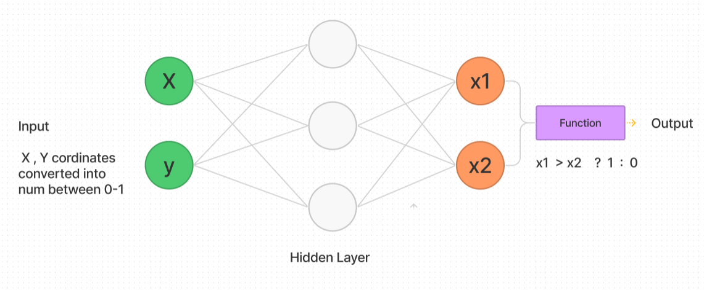

# nueral network visulisation

understand how neural nets learn work by doing it yourself !\
set weights and bias to make your algorithm understand a basic relation `x > y ? 1 : 0`

check it out [HERE](https://ayushmantripathy.github.io/nueral_network_visulisation/)

